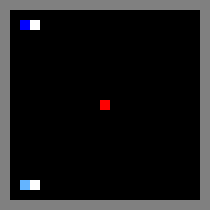

# Wolfpack

Two independent-learner wolves chase a scripted, non-learning prey on a
21×21 grid (each wolf's own local observation crop is smaller, 16×21,
matching the paper's `R^{3×16×21}`). When a wolf touches the prey, every wolf within `capture_radius`
of the prey *at that moment* shares a reward of `r_team`; a wolf that
captures alone, with its partner too far away, gets the smaller `r_lone`
instead (partner gets nothing). The prey then respawns and the episode
continues. This is Leibo et al. (2017)'s Sec. 5.2 game — see
[`__init__.py`](__init__.py) for the exact mechanics and reward values
(`r_team=5.0`, `r_lone=1.0` by default).

## The dilemma: Stag Hunt, not Prisoner's Dilemma

[`leibo2017/analysis/egta.py`](../../analysis/egta.py) implements the
paper's own classification scheme (Sec. 2.2): play trained
cooperator-pool and defector-pool policies against each other, average
the resulting returns into an *empirical* payoff matrix `(R, P, S, T)`,
then classify it as **Stag Hunt** specifically when `R > P` and
`fear = P − S > 0` and `greed = T − R ≤ 0` (`PayoffEstimate.classify()`).
This repo hasn't run that classification at meaningful scale for
Wolfpack specifically yet (see the top-level `RESULTS.md`'s EGTA section) —
what follows is the *expected* classification, reasoning from the reward
structure itself rather than a measured result:

Mapping "cooperate" = hunt together, "defect" = rush off and chase the
prey solo:

- **No greed problem expected**: betraying a cooperating partner
  shouldn't pay *more* than mutual cooperation would —
  `r_lone (1.0) < r_team (5.0)`. There's no individual incentive to
  defect against a partner who's playing along; team capture is
  strictly the better outcome whenever it's achievable.
- **Real fear problem expected**: if you hang back to coordinate with
  your partner but *they* go solo, you get nothing — the sucker's
  payoff, since only the wolf that touches the prey (and whoever else is
  in radius) gets rewarded. Whereas if you *also* just chase solo
  (mutual defection), you at least sometimes grab the lone reward
  yourself.

So the incentive to go it alone isn't greed, it's risk-aversion:
coordinating requires trusting your partner will also commit to the joint
hunt, and if that trust is misplaced you walk away empty-handed. Going
solo is a lower-but-safer payoff — exactly the "stag vs. hare" trade-off
the Stag Hunt is named for: hunting the stag (team capture) together
yields more for everyone, but only if both commit; hunting hare alone
(`r_lone`) is worse, but doesn't depend on anyone else showing up.

### Is Stag Hunt actually a social dilemma?

Yes — by the paper's own four-way classification that `egta.py`
implements (Prisoner's Dilemma / Chicken / Stag Hunt / non-SSD), Stag
Hunt is one of the three dilemma categories, not the "no dilemma" case.
Only "Non-SSD" (`R ≤ P`, or `R > P` with neither fear nor greed) means
there's no dilemma at all.

What makes it a dilemma even without greed: `R > P` — mutual cooperation
(both wolves committing to the joint hunt) is collectively better than
mutual defection (both going solo). That's the baseline requirement for
*any* social dilemma. On top of that, Stag Hunt adds `fear > 0`: a wolf
that commits to coordinating risks getting nothing if its partner doesn't
reciprocate. So even though no individual wolf ever benefits from
*betraying* a cooperating partner (that's what rules out greed), a purely
self-interested, risk-averse wolf can still rationally choose the safer,
lower-value solo strategy out of uncertainty about its partner — and if
both wolves reason that way, they land on the collectively worse
mutual-defection outcome despite mutual cooperation being available and
better for both.

That's the technical distinction from Prisoner's Dilemma: PD gives every
player a dominant strategy to defect regardless of what the other player
does (fear *and* greed). Stag Hunt has *two* stable equilibria —
both-cooperate and both-defect — and the dilemma is a coordination/trust
problem: which equilibrium do you converge on when you can't be sure of
your partner. It's sometimes called an "assurance game" for exactly that
reason. Still very much a social dilemma, just one solved by building
trust/coordination rather than by removing temptation.

## Training result: learning to trust the stag hunt

Trained with Ray RLlib's DQN backend (optional, additive to this repo's
own from-scratch independent-DQN implementation — see the top-level
README's "Optional: RLlib backend" section, [`run_rllib_train.py`](../../../run_rllib_train.py)
and [`render_rllib_rollout.py`](../../../render_rllib_rollout.py)), 10,000
iterations, 30 parallel env runners, GPU-backed learner:

| iterations | mean episode return | eval capture rate |
|---|---|---|
| 1–1,000 | 2.67 | — |
| 9,001–10,000 | **76.04** | **11 captures/episode, every one a coordinated 2-wolf catch** |

The final greedy eval episode: **11/11 captures with `avg_wolves_per_capture=2.0`** —
never once a solo grab. Both wolves earned `r_team` (5.0 × 11 = 55.0 each)
every single time. That's what "learning to trust the stag hunt" looks
like empirically: the policy converged to *always* coordinating rather
than ever settling for the safer, lower-value solo capture.



*Gold flash marks the exact frame of each capture (the prey respawning
elsewhere the same frame would otherwise make a catch easy to miss in the
animation); the white marker one cell ahead of each wolf shows its facing
direction — see `render()` in `__init__.py`.*

### Getting there took three fixes, not just more compute

Naively scaling up (parallel env runners, bigger batch size) barely moved
the needle — mean return crept from 0.087 to 0.111 over several attempts.
The actual breakthrough was realizing RLlib's DQN, with `training_intensity`
left at its default, does **exactly one gradient update per training
iteration** regardless of how much data gets collected — so 1,000
iterations trained the network on only 1,000 total batches, no matter how
many parallel env runners were collecting experience. Setting
`--updates-per-iteration 20` (an explicit `training_intensity`) was the
single change that turned a flat, noisy ~0.1 mean return into a steep,
still-climbing curve reaching 76+ by iteration 10,000. Two smaller,
related fixes (correctly scaling DQN's epsilon-decay schedule and
target-network update frequency for parallel env runners, both of which
silently assumed a single env runner) compounded on top of that. See the
top-level README's "Optional: RLlib backend" section and the git history
for the full diagnostic trail.

### Reproducing

```bash
pip install -r requirements-rllib.txt   # from repo root
python render_rllib_rollout.py --game wolfpack --algo DQN \
    --iterations 10000 --num-env-runners 30 --gpu \
    --train-batch-size 256 --updates-per-iteration 20
```

Saves a checkpoint to `~/simulation_results/ray_results/DQN_Leibo2017_Wolfpack_<timestamp>/`
and renders a greedy eval episode to
`output/render_rllib_rollout/wolfpack_dqn_rollout.gif`.
